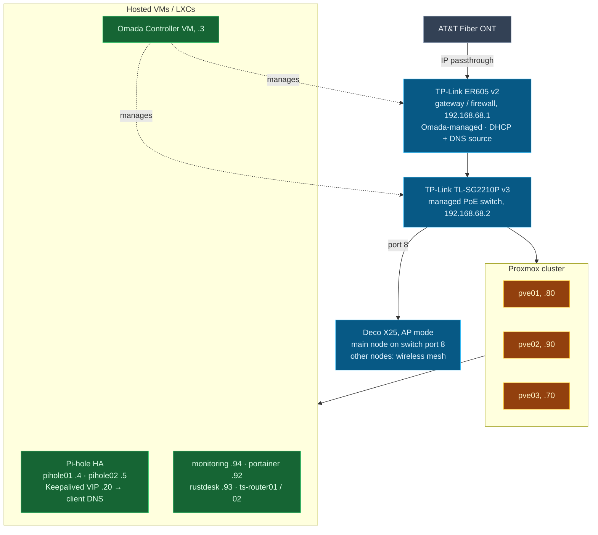

# Current Topology: Managed Network (Omada, flat)

The network as it runs today: a single flat `192.168.68.0/24`, managed by
the Omada Controller, with the Pi-hole HA pair providing DNS behind a
Keepalived VIP.

**Single flat `192.168.68.0/24` · VLAN 1 only · no segmentation.** VLAN
segmentation, inter-VLAN firewall policy, and SSID-to-VLAN mapping are the
next phase. A "Target State (UniFi)" variant of this diagram will land with
the router/switch migration. Same layout, with ER605 → UDM Pro (`.1`),
SG2210P → USW-24-PoE (`.2`), Deco unchanged.
