# Phase 1: Screenshots

## Screenshot Evidence for the Managed Network Cutover

---

## Overview

This page contains screenshot evidence captured after the managed network cutover.

The screenshots validate that routing, switching, DHCP, DNS, monitoring, management access, and remote access remained operational after moving to the ER605 router, managed switch, and AP-mode wireless design.

---

## Evidence Table

| Evidence | Category | Purpose |
|---|---|---|
| [ER605 WAN Online](../../screenshots/phase-1-managed-network-cutover/02-er605-wan-online.png) | Router / Gateway | Confirms the ER605 WAN interface came online after the cutover. |
| [ER605 LAN DHCP Configuration](../../screenshots/phase-1-managed-network-cutover/03-er605-lan-dhcp-config.png) | DHCP | Shows LAN DHCP configuration now controlled by the ER605. |
| [ER605 Address Reservations](../../screenshots/phase-1-managed-network-cutover/04-er605-address-reservations.png) | DHCP | Documents DHCP reservations for infrastructure devices. |
| [Managed Switch Online in Omada](../../screenshots/phase-1-managed-network-cutover/05-managed-switch-online-in-omada.png) | Managed Switch | Confirms the managed switch is online and visible in Omada. |
| [Managed Switch Port Map](../../screenshots/phase-1-managed-network-cutover/06-managed-switch-port-map.png) | Managed Switch | Shows active switch ports and physical connectivity. |
| [PoE Status for Pi Nodes](../../screenshots/phase-1-managed-network-cutover/07-poe-status-pi-nodes.png) | Power / Switching | Shows PoE status for infrastructure nodes connected to the managed switch. |
| [Wired Client DHCP from ER605](../../screenshots/phase-1-managed-network-cutover/10-wired-client-dhcp-from-er605.png) | Client Validation | Confirms a wired client received DHCP from the ER605-controlled network. |
| [Wi-Fi Client DHCP from ER605](../../screenshots/phase-1-managed-network-cutover/11-wifi-client-dhcp-from-er605.png) | Wireless Validation | Confirms a wireless client received DHCP from the ER605 while Deco operated in AP mode. |
| [Pi-hole Queries After Cutover](../../screenshots/phase-1-managed-network-cutover/13-pihole-queries-after-cutover.png) | DNS | Shows Pi-hole receiving queries after the managed network cutover. |
| [HA DNS VIP Reachable After Cutover](../../screenshots/phase-1-managed-network-cutover/14-ha-dns-vip-reachable-after-cutover.png) | DNS High Availability | Confirms the HA DNS virtual IP remained reachable. |
| [Proxmox Access After Cutover](../../screenshots/phase-1-managed-network-cutover/15-proxmox-access-after-cutover.png) | Infrastructure | Confirms Proxmox remained reachable after the cutover. |
| [Grafana Access After Cutover](../../screenshots/phase-1-managed-network-cutover/16-grafana-access-after-cutover.png) | Monitoring | Confirms Grafana remained reachable after the cutover. |
| [Omada Controller After Cutover](../../screenshots/phase-1-managed-network-cutover/17-omada-controller-after-cutover.png) | Management | Confirms Omada Controller remained accessible after the cutover. |
| [RustDesk Access After Cutover](../../screenshots/phase-1-managed-network-cutover/18-rustdesk-access-after-cutover.png) | Remote Access | Confirms private remote access remained available after the cutover. |
| [Final Omada Topology and Client List](../../screenshots/phase-1-managed-network-cutover/20-final-omada-topology-client-list.png) | Topology | Shows final managed network visibility after the cutover. |

---

## Evidence Gallery

### ER605 WAN Online

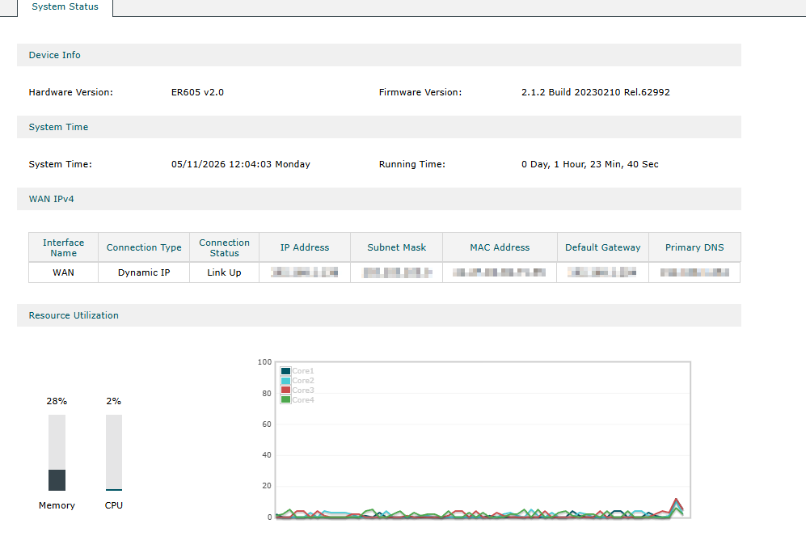

Confirms the ER605 WAN interface came online after the cutover.

---

### ER605 LAN DHCP Configuration

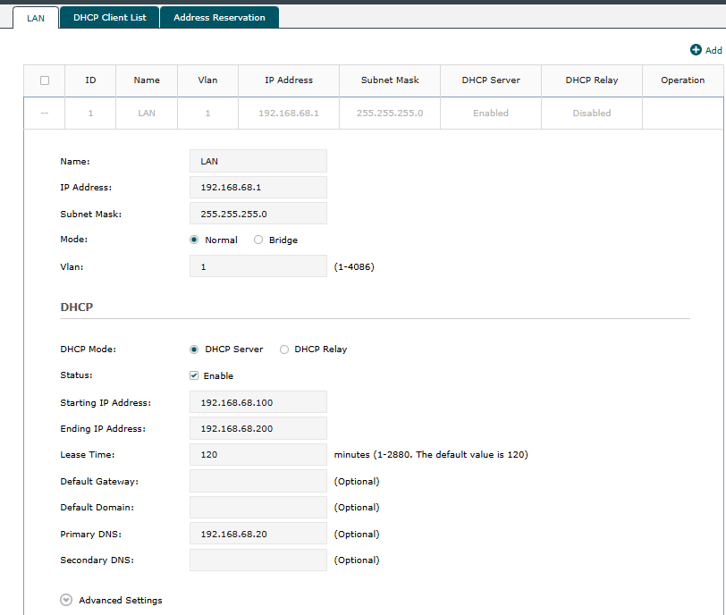

Shows LAN DHCP configuration now controlled by the ER605.

---

### ER605 Address Reservations

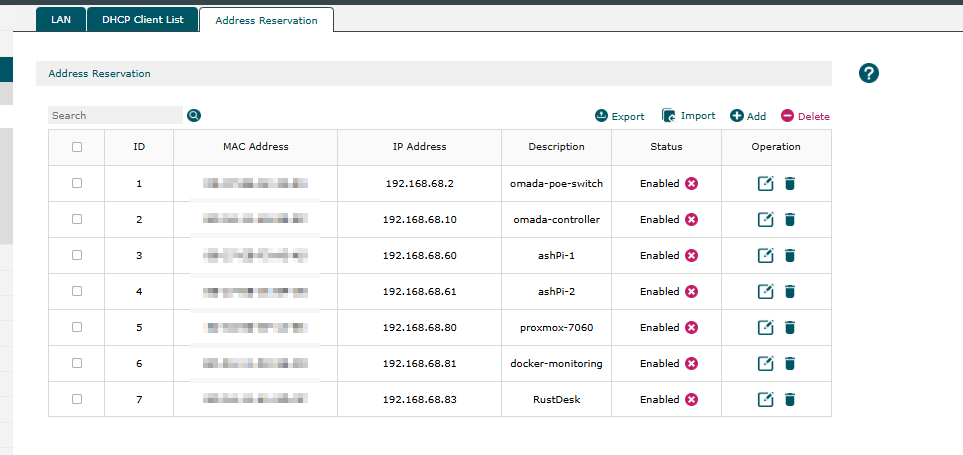

Documents DHCP reservations for infrastructure devices.

---

### Managed Switch Online in Omada

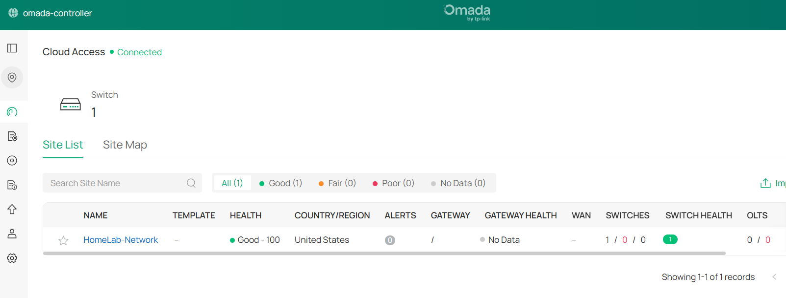

Confirms the managed switch is online and visible in Omada.

---

### Managed Switch Port Map

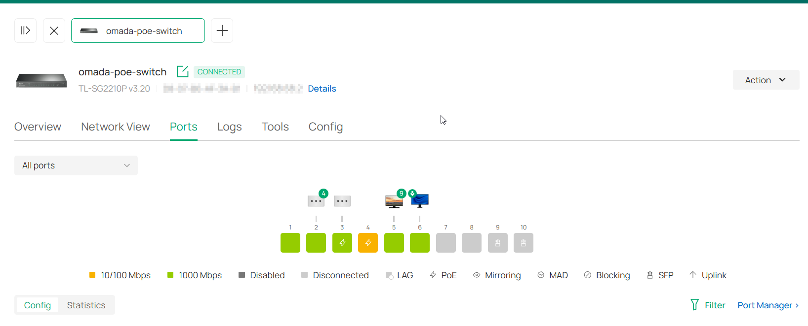

Shows active switch ports and physical connectivity.

---

### PoE Status for Pi Nodes

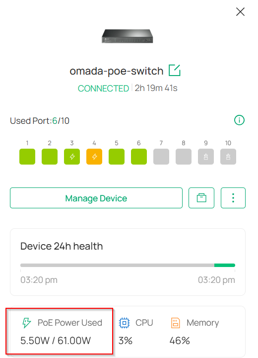

Shows PoE status for infrastructure nodes connected to the managed switch.

---

### Wired Client DHCP from ER605

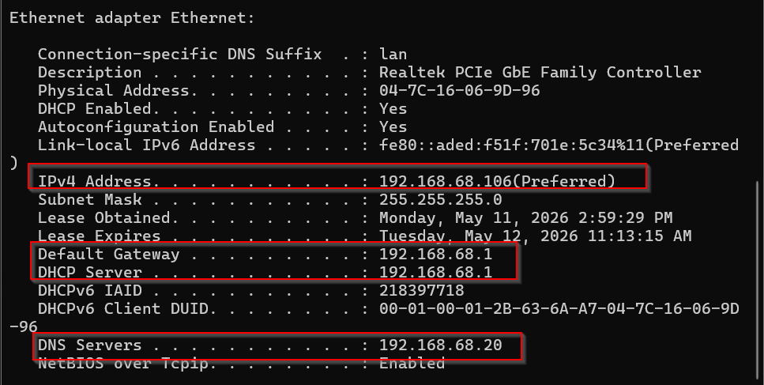

Confirms a wired client received DHCP from the ER605-controlled network.

---

### Wi-Fi Client DHCP from ER605

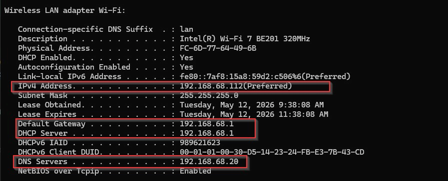

Confirms a wireless client received DHCP from the ER605 while Deco operated in AP mode.

---

### Pi-hole Queries After Cutover

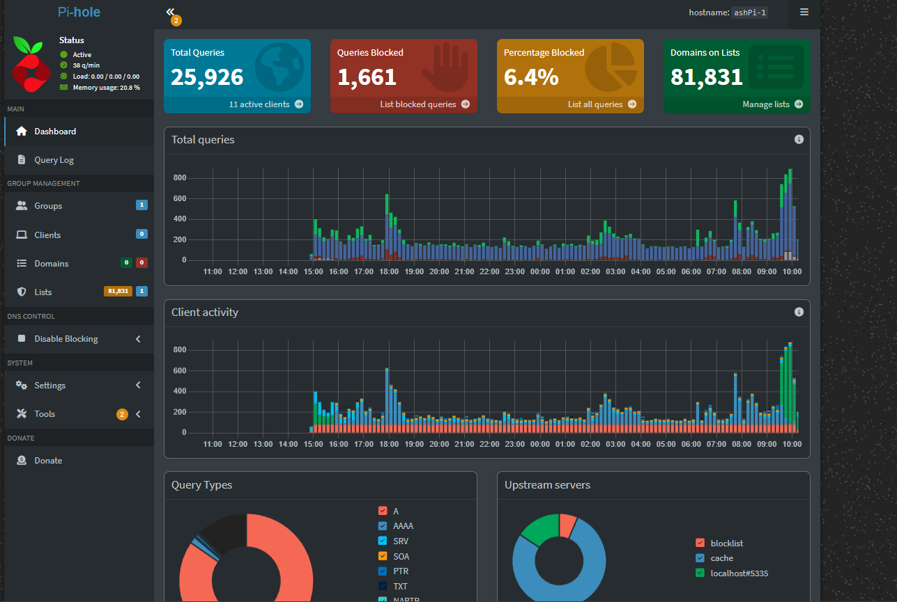

Shows Pi-hole receiving queries after the managed network cutover.

---

### HA DNS VIP Reachable After Cutover

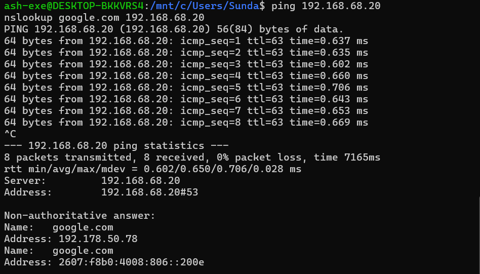

Confirms the HA DNS virtual IP remained reachable.

---

### Proxmox Access After Cutover

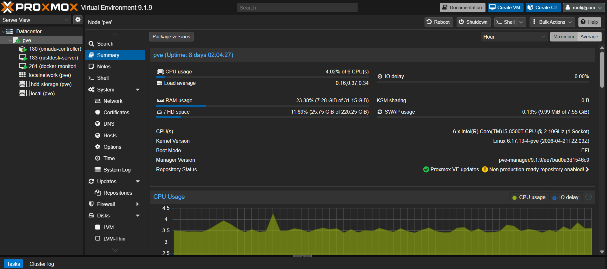

Confirms Proxmox remained reachable after the cutover.

---

### Grafana Access After Cutover

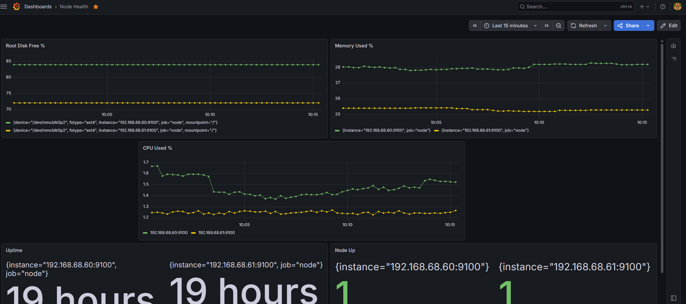

Confirms Grafana remained reachable after the cutover.

---

### Omada Controller After Cutover

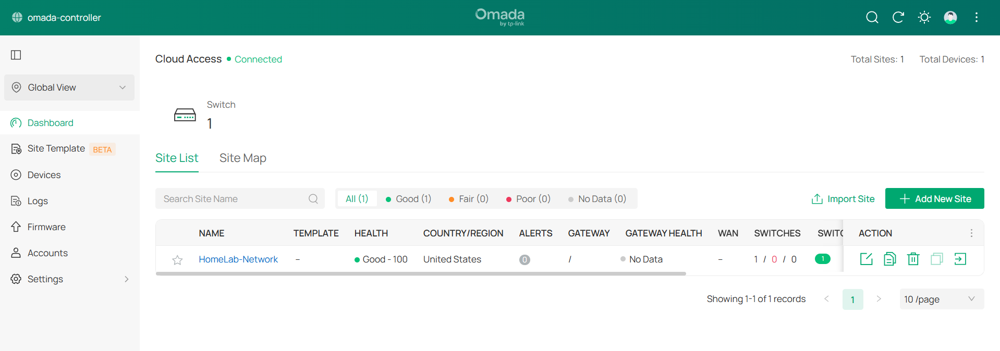

Confirms Omada Controller remained accessible after the cutover.

---

### RustDesk Access After Cutover

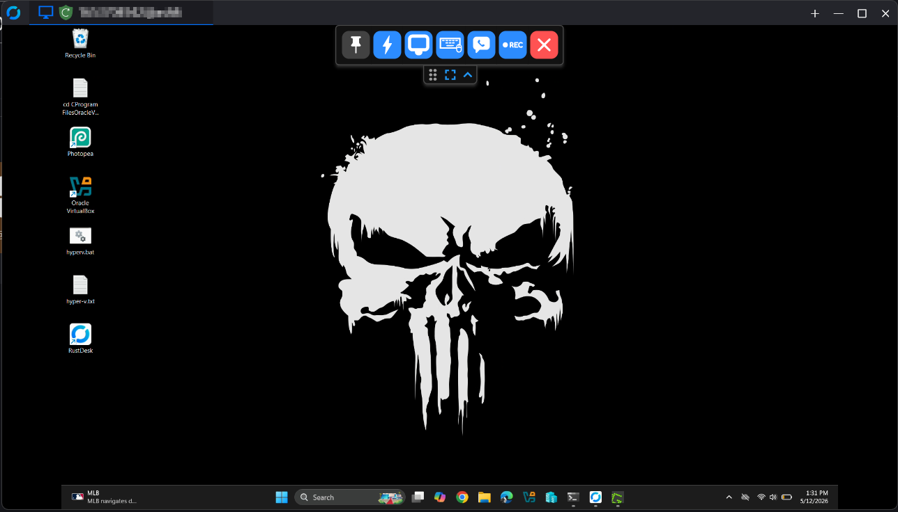

Confirms private remote access remained available after the cutover.

---

### Final Omada Topology and Client List

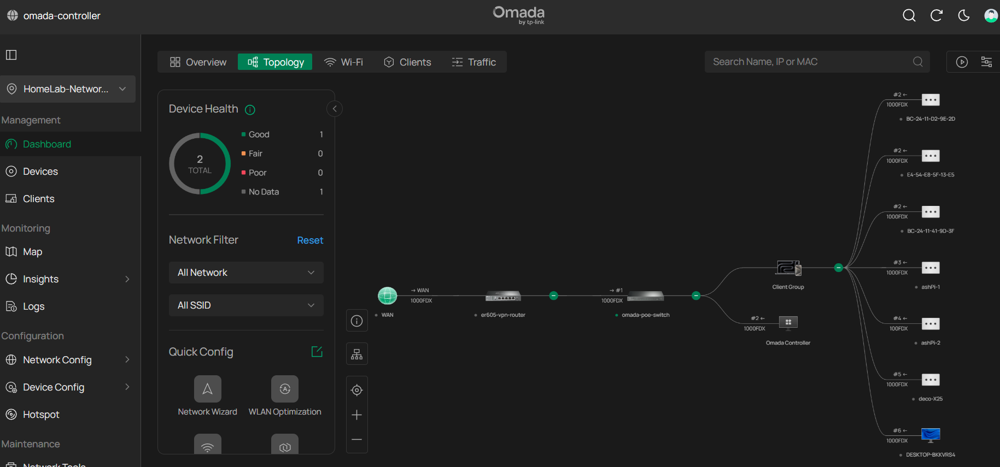

Shows final managed network visibility after the cutover.

